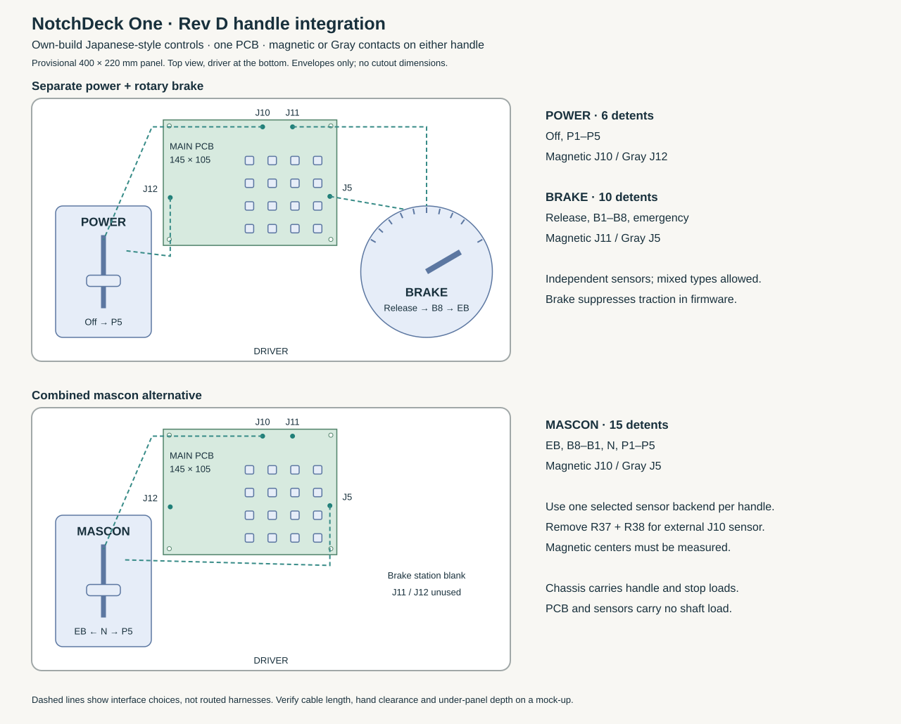

# Japanese-style handles on the Rev E controller

Build either a left-hand power lever and a right-hand rotary brake, or a combined
mascon, around the same NotchDeck One PCB. The mechanisms are chassis mounted;
the sensor boards and main PCB do not carry handle, bearing or end-stop loads.
Each active handle independently selects magnetic sensing or a Gray-code cam.

This is our own-build interface, not a plug-compatible railway controller.
JR East describes its 211-series two-handle arrangement as left-hand power and
right-hand brake ([operator reference](https://media.jreast.co.jp/articles/4293)).
That establishes the arrangement, not universal notch counts, shaft dimensions or
connector wiring. Our P5/B8 baseline also supports the combined 15-position
layout described by [ZUIKI](https://www.zuiki.co.jp/topics_customer/news-article16/).
Automatic-air-brake positions such as running/lap/service are not implemented.

## Mechanism contract

| Assembly | Travel and detents | Sensor connection |
|---|---|---|
| Left power lever | Off, P1–P5; six stops, positive end stops. Provisional fore/aft mechanism, pull toward driver for power. | AS5600 at J10, or three contact cam tracks at J12 |
| Right rotary brake | Release, B1–B8, EB; ten stops on a bounded rotation. Provisional clockwise rotation increases braking. | AS5600 at J11, or four contact cam tracks at J5 |
| Combined mascon | EB, B8–B1, N, P1–P5; fifteen stops. Provisional fore/aft mechanism, forward for braking, toward driver for power. | AS5600 at J10, or four contact cam tracks at J5; J11 and J12 unused |

Use a separate detent plate and spring-loaded follower for feel. The sensing
mechanism reads the shaft position; it does not create the detents or take stop
loads. Give N/Off/Release an identifiable detent. Provide a distinct mechanical
barrier or higher effort between maximum service braking and EB; the provisional
geometry leaves a larger angular interval there. Select the actual spring forces,
release mechanism, shaft, bearings and fasteners during the mechanical prototype.

A magnetic carrier puts a diametrically magnetized magnet on the shaft end and an
AS5600 board centered below it. On a fore/aft lever, the sensor follows the
horizontal pivot axis; on the rotary brake, it follows the vertical axis. Use an
adjustable carrier to set the magnet gap and alignment. For Gray sensing, replace
the magnet/carrier with three or four coaxial cam tracks and stationary microload
switches. Both sensor options use the same detent plate and mechanical stops.
The AS5600 carrier PCB and cam/switch brackets remain to be detailed.

## Harnesses

Rev D replaces the individual Rev C bit plugs with one keyed harness per cam:

| Pin | J12 POWER GRAY, PHR-5 housing | J5 BRAKE / MASCON GRAY, PHR-6 housing |
|---|---|---|
| 1 | GND, all switch common terminals | GND, all switch common terminals |
| 2 | S0 | S0 |
| 3 | S1 | S1 |
| 4 | S2 | S2 |
| 5 | 3V3; leave cavity empty for passive contacts | S3 |
| 6 | — | 3V3; leave cavity empty for passive contacts |

Connect normally-open microload contacts between the indicated bit and GND.
A cam lobe closes the contact where the CSV says `switches_closed_to_ground`.
Read pin numbers from the PCB/header drawing; do not infer numbering from wire
colors or an assumed cable view. Check continuity before plugging in. The 3V3
pins allow an externally designed active Gray sensor with 3.3V open-drain outputs;
its load, local decoupling and output behavior must be reviewed before use. Do
not feed voltage into any port. Rev C individual contact cables do not fit this
new pinout.

Magnetic ports J10/J11 retain PHR-4 housings: **1=3V3, 2=GND, 3=SDA, 4=SCL**.
For this panel layout, use external sensor boards and remove **both R37 and R38**
to isolate onboard U5 from J10. Keep cables short, initially ≤20cm for I²C,
strain-relieved and inside the enclosure; verify rise time at 100kHz. The layout's
dashed paths show connection choices, not measured harness lengths. Reposition
the PCB if the actual route cannot meet the cable target. Power down to change
harnesses. Detailed circuit behavior is in the [interface guide](06-handle-interfaces.md).

## Adjustable layout and cam targets



- [`handle-layout.json`](../hardware/mechanical/handle-layout.json) records the
  provisional 400×220mm panel, module envelopes and target detent angles.
- [`handle-layout.svg`](../hardware/mechanical/handle-layout.svg) shows the actual
  115×90mm logic PCB and separate 86×120mm 4×4 button board within those envelopes. It is an integration
  drawing, not a cutting template or an enclosure fit check.
- [`detents-and-cams.csv`](../hardware/mechanical/detents-and-cams.csv) gives all
  31 targets across the three assemblies, electrical Gray levels, contacts that
  close and connector pins. Codes are read directly from `handle_decode.c`.

Regenerate after changing the provisional geometry:

```sh
python3 hardware/scripts/notchdeck-handle-layout.py
```

The target angles are design inputs for a mock-up, **not magnetic calibration**.
Place cam transitions halfway between adjacent detent centers, with generous
stable regions around each detent; adjust ramp shape for the selected follower's
travel and hysteresis. For magnetic builds, measure each assembled detent's raw
angle and populate `handle_calibration.h`; uncalibrated magnetic profiles remain
faulted. No complete cam, shaft, bearing carrier or production cutout CAD is
implied by this layout study.

## Build selection and bring-up

Use `dual_gray.conf`, `dual_magnetic.conf`, or either mixed profile for the separate
handles. Use `combined_gray.conf` or `combined_magnetic.conf` for the mascon.
Handle GPIO assignments, sensor channels and cam maps remain unchanged in Rev E. The old Rev C/D direct button/RGB overlay does not support the new STM32 panel; its firmware and main I²C integration remain required. See [button interface](../hardware/notchdeck-buttons/README.md).
The [interface guide](06-handle-interfaces.md#firmware-profiles-and-output) has the
build command and complete output/fault behavior.

On a mock-up, verify every detent and every transition in both directions. Check
Off/Release or N is required at startup, brake suppresses traction, and disconnecting
either active sensor eventually commands power off and EB. All-open Gray patterns
are invalid; individual broken/shorted wires can still resemble valid positions.
Measure magnetic margins and signal quality with the handles under load. Only
then freeze the panel openings, bearings, stops and spring settings.

The main PCB BOM is entirely JLCPCB catalog parts with recorded public availability
for five boards. Mating housings/crimps, external AS5600 carrier boards, microload
switches, magnets and mechanical hardware are **not yet a sourced assembly kit**.
Their stock must be checked once those exact parts are selected; private inventory
can be used where available. No parts have been ordered.
